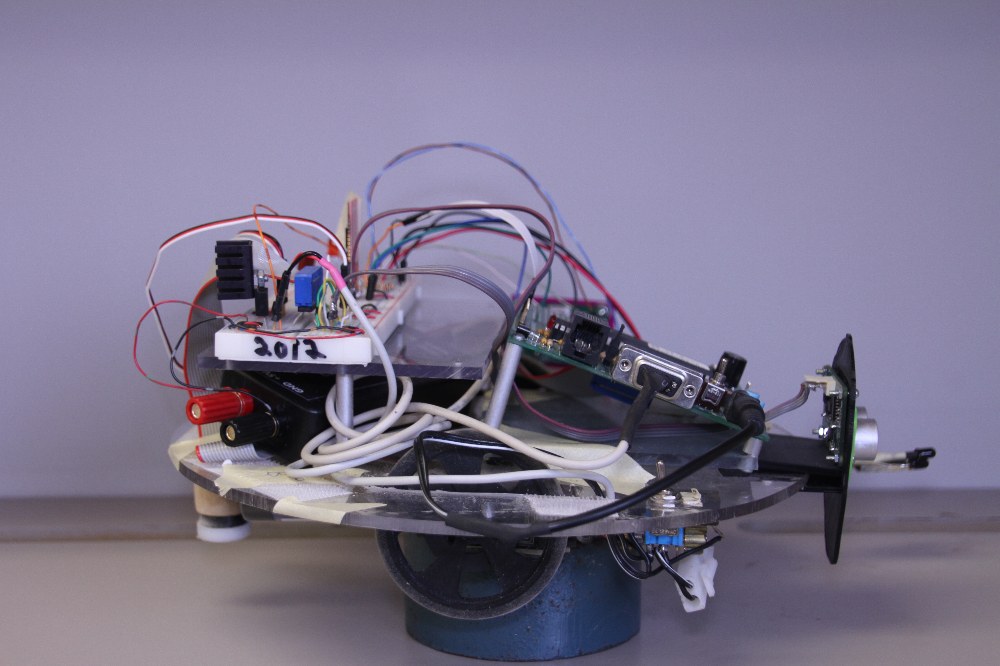

<html><head>
	<title>TUkkA RASk: CP316 Final Project</title>
	<link href="./bootstrap.css" rel="stylesheet" type="text/css">
	<link href="./styles.css" rel="stylesheet" type="text/css">
	<link href="../doc-assets/analysis.css" rel="stylesheet" type="text/css">
</head>
<body>
	
	

		<h1 class="title">TUkkA RASk: CP316 Final Project</h1>
		<h4 id="subtitle"><strong>T</strong>radigital <strong>U</strong>nmanned <strong>A</strong>utonomous <strong>R</strong>obot <strong>A</strong>rea <strong>S</strong>canner</h4>
		 
		<h4>Authors</h4>
		<ul id="authors">
			<li>Matt Hengeveld</li>
			<li>Henry Goddard</li>
		</ul>
		

			

				<h4>Table of Contents</h4>
				<ol>
					<li><a href="#intro">Introduction</a></li>
					<li><a href="#use">Usage Instructions</a></li>
					<li><a href="#tech">Technical Specifications</a></li>
					<li><a href="#schematic">Schematics</a></li>
					<li><a href="#gallery">Gallery</a></li>
					<li><a href="#refer">References</a></li>
				</ol>
			

			

				
			

		

		 
		 
		

		<section id="intro">
			<h2 class="heading1">1Introduction</h2>
			

			TUkkA RASk is an autonomous, microprocessor driven rover designed to locate and record frequencies of randomly placed, infared emitting beacons. It's main processor is a PIC18F452. The QwikFlash development board is directly used in the application.
			 The name draws inspiration from renown Finnish ice hockey goaltender, TUkkA RASk of the NHL's Boston Bruins. The goal of this project is to successful get Tukka Rask to find and collect the frequency of 5 different beacons.
			

		</section>
			<a href="#top">Back to Top</a>
		
		<section id="use">
			<h2 class="heading1">2Usage Instructions</h2>
			

			This section is dedicated to the proper utilization and initialization of TUkkA RASk, as well as the necessary steps involved in diagnosing potential issues early on.
			

			<section id="started">
				<h2 class="heading2">2.1Getting Started</h2>
				

				TuKKA RASk requires a fully charged NiMH (7.2V) battery for operation. It should be securely fastened to the underside of the circular base with the pre-installed velcro Next, ensure that the main power switch on the front left hand (facing) side of the robot clip is toggled to the upward 'Off' position. Furthermore, properly adjust the ON/OFF switch on the QwikFlash board to the OFF position if not already. Now fasten the female end (battery) to the male clip located directly beneath the main power switch. Ensure that both wheel wells are clear of debris. Straighten any curves/bends that may have happened to the photodiodes protruding from the front right of the robot.
				

			</section>
			<section id="powerup">
				<h2 class="heading2">2.2Powering on and Preliminary System Check</h2>
				

				Once the power source is connected, toggle the main power switch to the downward 'On' position followed by the smaller ON switch (SW1) located on the QwikFlash board. A small system check is to be performed before proceeding with the main functionality of the robot.
					
<ol>
						<li>
						The red, LED on the breadboard atop the platform, located on the far right hand (facing) side is lit.
						</li>
						<li>
						The red, rectangular bluetooth transmitter located in the middle of the breadboard is intermittently flashing a red LED.
						</li>
						<li>
						The Alive(D2) and Power(D1) LEDs on the QwikFlash development board are both lit. 
						</li>
						<li>
						Printed on the first level of the QwikFlash LED screen should be the word 'Beacons', followed on the second level with one asterisk (*).
						</li>
					</ol>
				

			</section>
			<section id="running">
				<h2 class="heading2">2.3Running</h2>
				

				Now that a preliminary status check of the robot has been performed, it is time to enter TUkkA RASk into search mode. The following step are required.
					
<ol>
						<li>
						Place the robot on the floor and clear the area in its immediate proximity.
						</li>
						<li>
						Using the RPG (rotary pulse generator RPG1) on the QwikFlash board, enter the desired amount (up to a maximum of 5) of beacons to find. Each asterisk (*) represents a beacon.
						</li>
						<li>
						Once the desired amount has been entered, press the momentary push button (SW3) the bottom right hand corner of the QwikFlash Board. The robot will engage motors and begin autonomously scouting the room.
						</li>
						<li>
						TUkkA RASk will automatically avoid obstacles using it's twin Ultrasonic sensors. It will pause upon beacon detection, and display the value of the frequency on the LCD screen for 5 seconds. After this period, the robot will continue its search.
						</li>
						<li>
						To halt the robot, effectively cancelling the routine, press the restart button (SW2) located in the upper middle portion of the QwikFlash board. This will return the robot to beacon number entry mode. 
						</li>
					</ol>
				

			</section>
			<section id="powerdown">
				<h2 class="heading2">2.4Powering Down</h2>
				

					Once the entire procedure has been completed, undergo to following steps to ensure that TUkkA RASk is properly shut down.
				

				<ol>
					<li>
					Toggle the ON/OFF (SW1) switch on the QwikFlash board to the off position, followed by the main power switch on the base of the robot.
					</li>
					<li>
					Detach the clip connecting the battery from the main male power connector. Carefully peel the 7.2V NiMH battery off the velcro on the underside of the robot. 
					</li>
				</ol>
			</section>
		</section>
			<a href="#top">Back to Top</a>	
			
		<section id="tech">
			<h2 class="heading1">3Technical Specifications</h2>
			

			This section will outline the various inputs and outputs associated with TUKKa RASk as well as a brief explanation of the assembly algorithm.
			

			<section id="in">
				<h2 class="heading2">3.1Inputs</h2>
				

				The various components sending input and effectively acting as senses, to the robot are as follows.
				

				<ul id="components">
					<li>
						<strong>Ultrasonic Sensor</strong>
						
 The ultrasonic sensors have four inputs each. The components do have an on board oscillator so a 5V supply and ground are therefore required. The sensors then require a signal consisting of 200ms spaced pulses to act as the sending signal. Finally, a delayed response signal is output through the remaining pin. One can then calculate the distance keeping in utilizing the speed of sound. TUkkA RASk employs two ultrasonic sensors. One in order to ensure adequate distance along side a wall, and the other to stop/avoid head on walls/obstacles.
						

					</li>
					<li>
						<strong>RPG (Rotary Pulse Generator)</strong>
						
 The small dial located on the bottom right hand side (facing) of TUkkA RASk serves as a method for menu selection. In this application is allows the user to select the number of beacons that are to be searched for before the autonomous search mode is entered.
						

					</li>
					<li>
						<strong>Infared Photodiodes</strong>
						
 TUkkA RASk utilizes three photodiodes located at the front left hand side (facing). These diodes are implemented in series and make use of a pull-up resistor to communicate that infared light has been detected. The robot searches for a rising edge (indicating a beacon has been found) and sets a flag on the capture register. By measuring the duration between captures, TUkkA RASk can effectively determine the frequency of the pulses. 
						

					</li>
					<li>
						<strong>Momentary Push Button</strong>
						
 Built into the QwikFlash board are two push buttons. TUkkA RASk uses both. The first, (SW2) acts as a reset button to pull the robot back into the first state (beacon entry). The second (SW3) is used to confirm the number of beacons to search for. 
						

					</li>
				</ul>
			</section>
			<section id="out">
				<h2 class="heading2">3.2Outputs</h2>
				

				The following devices are considered outputs and allow the robot to control itself, and provide feedback.
				

				<ul id="components">
					<li>
						<strong>Servo Motor</strong>
						
The servo motors give TUkkA RASk it's mobility. They each have three pins. A 20ms separated pulse of variable width is put into the remaining pin. Depending on the width of the pulse, the speed and direction of the motors is controlled. There exists a width such that the motor doesn’t move, this is known as the ‘dead zone’. The pulse width is of such precision, that two motors of the same model actually have different ‘dead zones’. Calibration constants for each motor are defined in the beginning of the program and separated into 4 speeds. Furthermore a 'Direction' toggle is defined to allow the speed to be either subtracted or added to the 'dead zone' so the appropriate direction is achieved. 
						

					</li>
					<li>
						<strong>LCD Screen</strong>
						
The QwikFlash board has a built in LCD screen that serves as a medium to instruct the user of which state the robot is in. Numbers stored in memory that are to be displayed on the screen are first required to be converted to BCD format and then to ASCII. 
						

					</li>
				</ul>
			</section>
			<section id="inout">
				<h2 class="heading2">3.3Inputs/Outputs</h2>
				

				The third and final classification of devices both send outputs, as well as facilitate the collection of input.
				

				<ul id="components">
					<li>
						<strong>BlueTooth Serial Module</strong>
						

							The bluetooth module communicates at 9600 baud. It uses an 8-bit configuration mode (as opposed to the 9-bit functionality). This allows TUkkA RASk to serially communicate ASCII characters and raw 8bit numbers two and from an external application connected via bluetooth. In this application, beacon entry can be performed as well as a manual navigation mode. Collected beacon frequency information is also sent to the external device.
						

					</li>
				</ul>
			</section>
			<section id="code">
				<h2 class="heading2">3.4Code</h2>
				

				The PIC8F452&nbsp;is programmed&nbsp;in PIC assembly.&nbsp;Both interrupts&nbsp;and polling&nbsp;techniques&nbsp;are used.&nbsp;The interrupts&nbsp;are mainly used&nbsp;to&nbsp;trigger&nbsp;'events'&nbsp;or&nbsp;flags,&nbsp;as&nbsp;well&nbsp;as&nbsp;for&nbsp;timing&nbsp;purposes.&nbsp;The main&nbsp;routine&nbsp;then&nbsp;polls&nbsp;these&nbsp;'events'.&nbsp;This&nbsp;system&nbsp;allows&nbsp;for&nbsp;quick interrupt&nbsp;handling.&nbsp;Timing&nbsp;functions,&nbsp;and&nbsp;servos&nbsp;interrupts&nbsp;are&nbsp;high priority.&nbsp;The&nbsp;CCP,&nbsp;ultrasonic&nbsp;sensors,&nbsp;and&nbsp;USART&nbsp;interrupts&nbsp;are&nbsp;low priority.&nbsp;CCP,&nbsp;and&nbsp;ultrasonics&nbsp;interrupts&nbsp;are&nbsp;only&nbsp;enabled&nbsp;when needed.
				

				

				All&nbsp;code&nbsp;is&nbsp;split&nbsp;into&nbsp;.inc&nbsp;files.&nbsp;Each&nbsp;file&nbsp;contains code&nbsp;for&nbsp;a&nbsp;specific&nbsp;function&nbsp;on&nbsp;the&nbsp;robot.&nbsp;Variables&nbsp;for&nbsp;each&nbsp;file&nbsp;are contained&nbsp;in&nbsp;separate&nbsp;files.&nbsp;This&nbsp;creates&nbsp;modualar&nbsp;code. All&nbsp;pins&nbsp;used&nbsp;for&nbsp;sensors,&nbsp;etc.&nbsp;have&nbsp;corresponding #defines,&nbsp;which&nbsp;increases&nbsp;human&nbsp;readability&nbsp;of&nbsp;code. Macro&nbsp;functions&nbsp;are&nbsp;included&nbsp;for&nbsp;often&nbsp;repeated&nbsp;code, including&nbsp;for&nbsp;the&nbsp;LCD,&nbsp;servos,&nbsp;and&nbsp;delays.
				

				

				.inc files include:
				

				<table class="table">
					<thead>
						<tr>
							<th>Filename</th>
							<th>Variables</th>
							<th>Description</th>
						</tr><tr>
					</tr></thead>
					<tbody>
						<tr>
							<td><a href="./code/main.asm"><strong>main.asm</strong></a></td>
							<td>-</td>
							<td>The main assembly file. All interrupts as well as polling are found here.</td>
						</tr>
						<tr>
							<td><a href="./code/LCD.inc"><strong>LCD.inc</strong></a></td>
							<td><a href="./code/LCDVARS.inc"><strong>LCDVARS.inc</strong></a></td>
							<td>for&nbsp;the&nbsp;LCD&nbsp;module</td>
						</tr>
						<tr>
							<td><a href="./code/BCD.inc"><strong>BCD.inc</strong></a></td>
							<td><a href="./code/BCDVARS.inc"><strong>BCDVARS.inc</strong></a></td>
							<td>for&nbsp;binary&nbsp;to&nbsp;BCD conversion</td>
						</tr>
						<tr>
							<td><a href="./code/Delay.inc"><strong>Delay.inc</strong></a></td>
							<td><a href="./code/DelayVARS.inc"><strong>DelayVARS.inc</strong></a></td>
							<td>for&nbsp;delays</td>
						</tr>
						<tr>
							<td><a href="./code/Servo.inc"><strong>Servo.inc</strong></a></td>
							<td><a href="./code/ServoVARS.inc"><strong>ServoVARS.inc</strong></a></td>
							<td>for&nbsp;the&nbsp;servo&nbsp;motors</td>
						</tr>
						<tr>
							<td><a href="./code/RPG.inc"><strong>RPG.inc</strong></a></td>
							<td><a href="./code/RPGVARS.inc"><strong>RPGVARS.inc</strong></a></td>
							<td>for&nbsp;the&nbsp;rotary&nbsp;pulse generator</td>
						</tr>
						<tr>
							<td><a href="./code/Ultrasonic.inc"><strong>Ultrasonic.inc</strong></a></td>
							<td><a href="./code/UltrasonicVARS.inc"><strong>UltrasonicVARS.inc</strong></a></td>
							<td>for&nbsp;the&nbsp;ultrasonic&nbsp;sensors</td>
						</tr>
						<tr>
							<td><a href="./code/Navigation.inc"><strong>Navigation.inc</strong></a></td>
							<td><a href="./code/NavigationVARS.inc"><strong>NavigationVARS.inc</strong></a></td>
							<td>for&nbsp;making&nbsp;decisions&nbsp;on navigation</td>
						</tr>
						<tr>
							<td><a href="./code/IR.inc"><strong>IR.inc</strong></a></td>
							<td><a href="./code/IRVARS.inc"><strong>IRVARS.inc</strong></a></td>
							<td>for&nbsp;the&nbsp;infrared&nbsp;sensors</td>
						</tr>
						<tr>
							<td><a href="./code/USART.inc"><strong>USART.inc</strong></a></td>
							<td><a href="./code/USARTVARS.inc"><strong>USARTVARS.inc</strong></a></td>
							<td>for&nbsp;the&nbsp;USART&nbsp;module</td>
						</tr>
					</tbody>
				</table>
		
			</section>
		</section>
			<a href="#top">Back to Top</a>	
		<section id="schematic">
			<h2 class="heading1">4Schematic</h2>
			
 Below is a schematic of the hardware associated (beyond the QwikFlash board). The callouts refer to which input pin on the PIC are interfaced.
			

			<embed src="images/schem.svg">
		</section>
			<a href="#top">Back to Top</a>
		<section id="gallery">
			<h2 class="heading1">5Gallery</h2>
			

				

					
					Front
				

				

					
					Left
				

				

					
					Right
				

				

					
					Rear
				

				

					
					Top
				

			

		</section>
			<a href="#top">Back to Top</a>	
		
		<section id="refer">
			<h2 class="heading1">6References</h2>
			
 The following is a list of links that were used in the development of TUkkA RASk.
			

			<ul id="tech">
				<li>
				Ultrasonic Sensors
				 <a href="http://denethor.wlu.ca/pc300/projects/sensors/ultrasonic_range.pdf">DUR5200 Ultrasonic Range Sensor Module User Manual</a>
				</li>
				<li>
				QwikFlash
				 <a href="http://www.wlu.ca/science/physcomp/nznotinas/cp316/qwikflash/hardware_qwik.shtml">QwikFlash Development Board Schematic</a>
				</li>
				<li>
				Servo Motors
				 <a href="http://www.es.co.th/schemetic/pdf/et-servo-s3003.pdf">S3003 FUTABA SERVO </a>
				</li>
				<li>
				Android Application
				 <a href="./code/TukkaRask.apk">TukkaRask.apk</a>
				</li>
				<li>
				Front Ultrasonic 3D Model
				 <a href="https://www.tinkercad.com/things/91E35AEx2KV-goalie-mask-ultrasonic-mount">Goalie Mask Ultrasonic Mount</a>
				</li>
				<li>
				Side Ultrasonic 3D Model
				 <a href="https://www.tinkercad.com/things/7nEplA1kxXS-ultrasonic-sensor-mount">Ultrasonic Sensor Mount</a>
				</li>
			</ul>
		</section>
			<a href="#top">Back to Top</a>	
			
	

	

</body></html>
